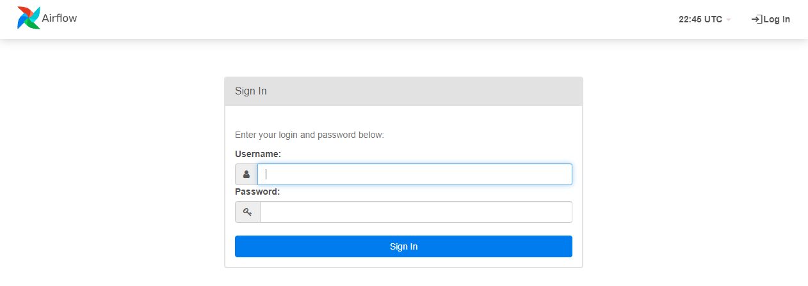
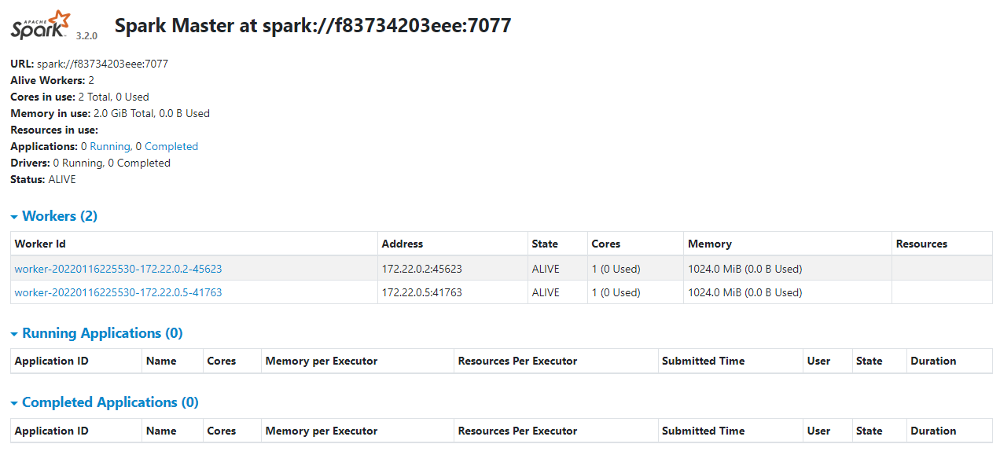
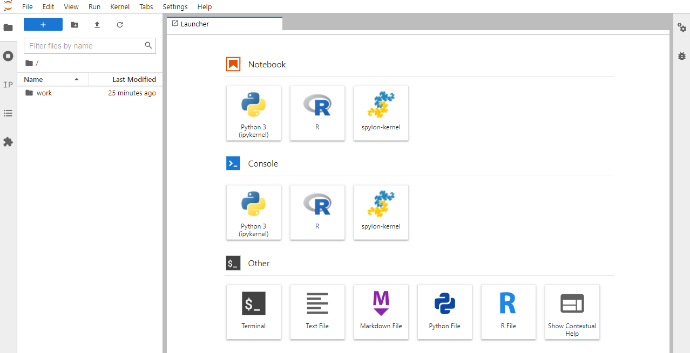

# Training Data Platform Engineer
As a Data Platform Engineer, one's goal is to architect and build cloud-native data pipelines and infrastructure to perform big data analytics and end-to-end machine learning projects.
## Training objectives
- Fundamentals of DevOps
  - Using docker and docker-compose
  - Manage docker containers via Terraform
- Airflow
  - Setting up airflow with docker
  - Writing your first dags
- Spark
  - Working with spark and jupyter lab 
  - Write a scala/python app to read from a s3 bucket
- Kafka
  - Build a Kafka services to produce/consume events
  - Kafka connect
  - processing events with KSQL stream
- DBT
  - To spin up the dbt only, use `docker-compose up --build -d dbt`, following `docker exec -it base-data-platform-stack_dbt_1 bash` to entre the environment
  - Getting started with DBT
  - Using DBT with Airflow
- End-to-end ML project capstone
  - EDA with Jupyter Lab
  - How to process & run ML project, the big data style  
  - Build an end-to-end ML project with BigQuery ML

# Base data platform stack
A development environment for prototyping and proof-of-concepting data platform designs. This repository provides pictures and scripts for quickly spinning up a tiny tech stack environment similar to what a data platform might encounter on a daily basis. This is intended for training and prototyping purposes only, and should not be used in production.  

# Setup Instruction
1. fulfill docker + docker-compose prerequisites in the airflow [README](https://github.com/stancsz/base-data-platform-stack/blob/main/docs/Airflow_README.md)
2. run the following code to export environment variables for airflow 
```
mkdir -p ./dags ./logs ./plugins
echo -e "AIRFLOW_UID=$(id -u)" > .env
# AIRFLOW_GID=0 may be needed
echo -e "AIRFLOW_GID=0" >> .env
```
3. init airflow
```
docker-compose up --build airflow-init
```
4. execute docker-compose to build the services in this stack
```
docker-compose up
```
if running in daemon is preferred
```
docker-compose up
```

## Airflow UI
http://localhost:8080/


## Spark UI
http://localhost:8082/


## Jupyter Lab
http://localhost:8888/


# Docker Example
```
$ docker-compose up
WARNING: Found orphan containers (base-data-platform-stack_spark-master_1) for this project. If you removed or renamed this service in your compose file, you can run this command with the --remove-orphans flag to clean it up.
Creating base-data-platform-stack_spark-worker-node-1_1 ... done
Creating base-data-platform-stack_spark-worker-node-2_1 ... done
Creating base-data-platform-stack_all-spark-notebook_1  ... done
Creating base-data-platform-stack_spark_1               ... done
Creating base-data-platform-stack_redis_1               ... done
Creating base-data-platform-stack_postgres_1            ... done
Creating base-data-platform-stack_airflow-init_1        ... done
Creating base-data-platform-stack_flower_1              ... done
Creating base-data-platform-stack_airflow-scheduler_1   ... done
Creating base-data-platform-stack_airflow-triggerer_1   ... done
Creating base-data-platform-stack_airflow-webserver_1   ... done
Creating base-data-platform-stack_airflow-worker_1      ... done
Attaching to base-data-platform-stack_postgres_1, base-data-platform-stack_spark-worker-node-2_1, base-data-platform-stack_spark-worker-node-1_1, base-data-platform-stack_redis_1, base-data-platform-stack_spark_1, base-data-platform-stack_all-spark-notebook_1, base-data-platform-stack_airflow-init_1, base-data-pla
tform-stack_airflow-scheduler_1, base-data-platform-stack_airflow-triggerer_1, base-data-platform-stack_airflow-worker_1, base-data-platform-stack_flower_1, base-data-platform-stack_airflow-webserver_1
airflow-init_1         | The container is run as root user. For security, consider using a regular user account.

```

```
$ docker ps
CONTAINER ID   IMAGE                        COMMAND                  CREATED              STATUS                        PORTS                              NAMES
c792711cab79   apache/airflow:2.2.3         "/usr/bin/dumb-init …"   About a minute ago   Up 41 seconds (healthy)       8080/tcp                           base-data-platform-stack_airflow-scheduler_1
b5d238244883   apache/airflow:2.2.3         "/usr/bin/dumb-init …"   About a minute ago   Up 40 seconds (healthy)       0.0.0.0:5555->5555/tcp, 8080/tcp   base-data-platform-stack_flower_1
53a42b944ade   apache/airflow:2.2.3         "/usr/bin/dumb-init …"   About a minute ago   Up 40 seconds (healthy)       8080/tcp                           base-data-platform-stack_airflow-worker_1
9f6efbc46a4c   apache/airflow:2.2.3         "/usr/bin/dumb-init …"   About a minute ago   Up 40 seconds (healthy)       0.0.0.0:80->8080/tcp               base-data-platform-stack_airflow-webserver_1
9f5535841078   apache/airflow:2.2.3         "/usr/bin/dumb-init …"   About a minute ago   Up 40 seconds (healthy)       8080/tcp                           base-data-platform-stack_airflow-triggerer_1
e53b7e0d509c   bitnami/spark:3              "/opt/bitnami/script…"   2 minutes ago        Up About a minute             0.0.0.0:8080->8080/tcp             base-data-platform-stack_spark-master_1
aa3cde52b858   jupyter/all-spark-notebook   "tini -g -- jupyter …"   2 minutes ago        Up About a minute             0.0.0.0:8888->8888/tcp             base-data-platform-stack_all-spark-notebook_1
9aea822f478a   bitnami/spark:3              "/opt/bitnami/script…"   2 minutes ago        Up About a minute                                                base-data-platform-stack_spark-worker-node-2_1
eac32a6d4bc3   postgres:13                  "docker-entrypoint.s…"   2 minutes ago        Up About a minute (healthy)   5432/tcp                           base-data-platform-stack_postgres_1
7a1ff9a55076   redis:latest                 "docker-entrypoint.s…"   2 minutes ago        Up About a minute (healthy)   6379/tcp                           base-data-platform-stack_redis_1
5a88cd517f7b   bitnami/spark:3              "/opt/bitnami/script…"   2 minutes ago        Up About a minute                                                base-data-platform-stack_spark-worker-node-1_1
```


# Stopping Services & Clean up environment
> https://airflow.apache.org/docs/apache-airflow/stable/start/docker.html#cleaning-up-the-environment

Stopping Airflow with docker compose down
```
docker-compose down
```
to remove images, `docker-compose down --volumes` and add `--rmi all` 

_additional commands:_

stop all docker containers
```
docker kill $(docker ps -q)
```
remove all docker containers
```
docker rm $(docker ps -a -q) 
```
prune all volumes
```
docker system prune -a --volumes
```