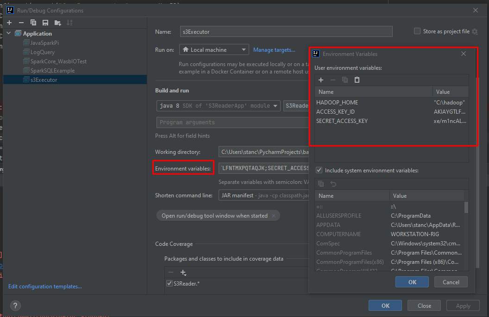
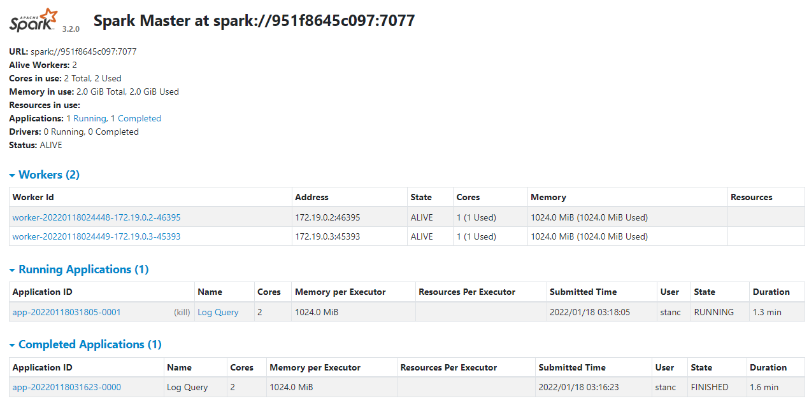

# S3 Reader APP

https://docs.microsoft.com/en-us/azure/hdinsight/spark/apache-spark-create-standalone-application#prerequisites

Created with Intellij, Scala and Azure Plugin for Intellij

# Setup Guide
1. Clone repo

2. maven clean install

3. run a sample app to verify the setup is successful 

4. configure environment variables


# Runtime Sample Logs
```
22/01/18 00:13:57 INFO SparkContext: Running Spark version 3.0.1
22/01/18 00:13:57 INFO SparkContext: Submitted application: SparkByExamples.com
# print rdd class
class org.apache.spark.rdd.MapPartitionsRDD
# print collect forech f
22/01/18 00:14:03 INFO TaskSetManager: Starting task 0.0 in stage 0.0 (TID 0, Workstation-Rig.mshome.net, executor driver, partition 0, PROCESS_LOCAL, 7438 bytes)
22/01/18 00:14:03 INFO Executor: Running task 0.0 in stage 0.0 (TID 0)
22/01/18 00:14:03 INFO HadoopRDD: Input split: s3a://skip-capstone-2022/grocery_order_transaction_data/2429657a-75e7-11ec-9197-0242ac1c0002.json:0+123
22/01/18 00:14:04 INFO Executor: Finished task 0.0 in stage 0.0 (TID 0). 1059 bytes result sent to driver
22/01/18 00:14:04 INFO TaskSetManager: Starting task 1.0 in stage 0.0 (TID 1, Workstation-Rig.mshome.net, executor driver, partition 1, PROCESS_LOCAL, 7438 bytes)
22/01/18 00:14:04 INFO Executor: Running task 1.0 in stage 0.0 (TID 1)
22/01/18 00:14:04 INFO TaskSetManager: Finished task 0.0 in stage 0.0 (TID 0) in 420 ms on Workstation-Rig.mshome.net (executor driver) (1/1349)
22/01/18 00:14:04 INFO HadoopRDD: Input split: s3a://skip-capstone-2022/grocery_order_transaction_data/2429698a-75e7-11ec-9197-0242ac1c0002.json:0+123
{
  "order_id": "2429657a-75e7-11ec-9197-0242ac1c0002",
  "custo_id": 398,
  "order.item_grp_id": 86502,
  "order.qty": 1
}
{
  "order_id": "2429698a-75e7-11ec-9197-0242ac1c0002",
  "custo_id": 208,
  "order.item_grp_id": 77694,
  "order.qty": 1
}
{
  "order_id": "24296b56-75e7-11ec-9197-0242ac1c0002",
  "custo_id": 341,
  "order.item_grp_id": 1972,
  "order.qty": 1
}
...
```


Monitor UI
visit http://localhost:8082/ for the logs



