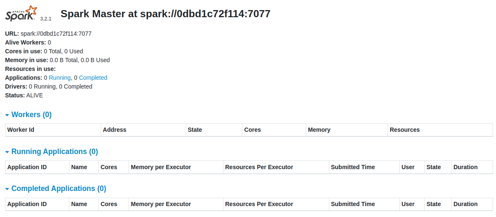
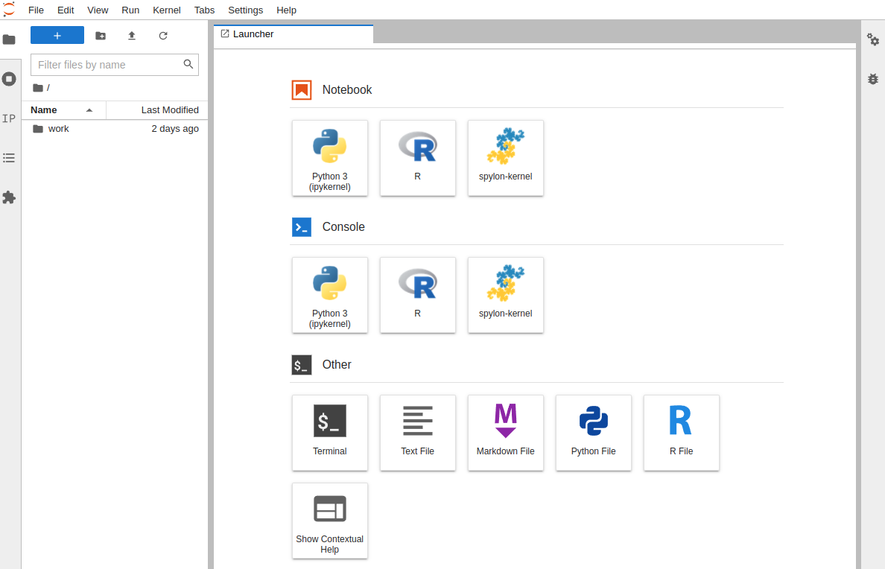

# Intro: terraform for spark and jupyter infrastructure

## Getting started
https://learn.hashicorp.com/tutorials/terraform/install-cli?in=terraform/docker-get-started

## install terraform
download & install
```
curl -fsSL https://apt.releases.hashicorp.com/gpg | sudo apt-key add -
sudo apt-add-repository "deb [arch=amd64] https://apt.releases.hashicorp.com $(lsb_release -cs) main"
sudo apt-get update && sudo apt-get install terraform
```
https://www.terraform.io/downloads

verify installation
```
terraform -help
```

# Setting up deeptendies data & ai platform terraform
## init, plan, fmt and apply infrastructure for spark and jupyter resources

##### terraform init
```
$ terraform init

Initializing the backend...

Initializing provider plugins...
- Reusing previous version of kreuzwerker/docker from the dependency lock file
- Using previously-installed kreuzwerker/docker v2.13.0

Terraform has been successfully initialized!

You may now begin working with Terraform. Try running "terraform plan" to see
any changes that are required for your infrastructure. All Terraform commands
should now work.

If you ever set or change modules or backend configuration for Terraform,
rerun this command to reinitialize your working directory. If you forget, other
commands will detect it and remind you to do so if necessary.
```
##### terraform plan
```
$ terraform plan

Terraform used the selected providers to generate the following execution plan. Resource actions are indicated with the following symbols:
  + create

Terraform will perform the following actions:

  # docker_container.jupyter_asn will be created
  + resource "docker_container" "jupyter_asn" {
      + attach           = false
      + bridge           = (known after apply)
      + command          = [
          + "jupyter",
          + "lab",
          + "--no-browser",
          + "--NotebookApp.token=''",
          + "--NotebookApp.password=''",
        ]
...
```
##### terraform fmt
```
$ terraform fmt
main.tf
```

##### terraform validate
```
$ terraform validate
Success! The configuration is valid.
```

##### terraform apply
```
$ terraform apply

Terraform used the selected providers to generate the following execution plan. Resource actions are indicated with the following symbols:
  + create

Terraform will perform the following actions:

  # docker_container.jupyter_asn will be created
  + resource "docker_container" "jupyter_asn" {
      + attach           = false
      + bridge           = (known after apply)
      + command          = [
          + "jupyter",
          + "lab",
          + "--no-browser",
          + "--NotebookApp.token=''",
          + "--NotebookApp.password=''",
        ]
      + container_logs   = (known after apply)
      + entrypoint       = (known after apply)
      + env              = [
          + "JUPYTER_ENABLE_LAB=yes",
...
Plan: 4 to add, 0 to change, 0 to destroy.

Do you want to perform these actions?
  Terraform will perform the actions described above.
  Only 'yes' will be accepted to approve.

  Enter a value: yes

docker_image.spark: Creating...
docker_image.jupyter_asn: Creating...
docker_image.spark: Still creating... [10s elapsed]
docker_image.jupyter_asn: Still creating... [10s elapsed]
...
```
checking with docker ps

```
$ docker ps
CONTAINER ID   IMAGE          COMMAND                  CREATED              STATUS              PORTS                    NAMES
5f460ecbaaeb   d20f7aaa2ef3   "tini -g -- jupyter …"   29 seconds ago       Up 28 seconds       0.0.0.0:8888->8888/tcp   jupyter_asn
0dbd1c72f114   5d390ac3341f   "/opt/bitnami/script…"   About a minute ago   Up About a minute   0.0.0.0:8082->8080/tcp   spark
```

visiting UIs 
http://localhost:8082/

http://localhost:8888/lab


##### terraform destroy (when finished)
```
$ terraform destroy
docker_image.jupyter_asn: Refreshing state... [id=sha256:d20f7aaa2ef38ed55192b2e87008970d61e3870309e52dfc7fe88b818910a1a0jupyter/all-spark-notebook]
docker_image.spark: Refreshing state... [id=sha256:5d390ac3341f5746085545179047a1681057df8c9a5580f5ac1945cf2fefc543bitnami/spark]
docker_container.jupyter_asn: Refreshing state... [id=337d4b57cffa9568ff10a7cf66d8f986a5c3aa805a44d2cb87abf677cdad7eb5]
docker_container.spark: Refreshing state... [id=2ac21e5d67f08dc30c74a51f2f63a1362a5544c85f0aa23f50aa7a561d56332c]
...
Plan: 0 to add, 0 to change, 4 to destroy.

Do you really want to destroy all resources?
  Terraform will destroy all your managed infrastructure, as shown above.
  There is no undo. Only 'yes' will be accepted to confirm.

  Enter a value: yes

docker_container.spark: Destroying... [id=2ac21e5d67f08dc30c74a51f2f63a1362a5544c85f0aa23f50aa7a561d56332c]
docker_container.jupyter_asn: Destroying... [id=337d4b57cffa9568ff10a7cf66d8f986a5c3aa805a44d2cb87abf677cdad7eb5]
docker_container.spark: Destruction complete after 1s
docker_image.spark: Destroying... [id=sha256:5d390ac3341f5746085545179047a1681057df8c9a5580f5ac1945cf2fefc543bitnami/spark]
docker_container.jupyter_asn: Destruction complete after 1s
docker_image.jupyter_asn: Destroying... [id=sha256:d20f7aaa2ef38ed55192b2e87008970d61e3870309e52dfc7fe88b818910a1a0jupyter/all-spark-notebook]
docker_image.spark: Destruction complete after 0s
docker_image.jupyter_asn: Destruction complete after 3s

```